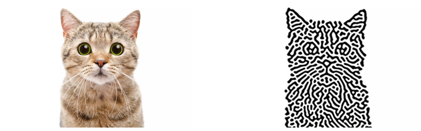
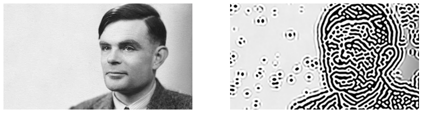

# Turing Pattern Generator

Generate, from an image, a Turing pattern that resembles the original image.

Simply done by repeating **blur** and **sharpen**.

All code in notebook, some results here:

